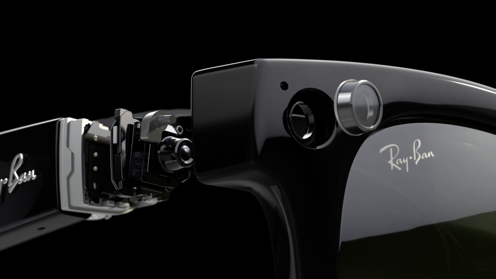

I wrote about the advantages of wearable AI tech for blind people back in 2020, when I bought a pair of [Envision Glasses](/envision-glasses). At the time they felt revolutionary, and indeed they were, but they never became part of my everyday tech. I've had my pair of [Ray-Ban Meta Glasses](https://www.ray-ban.com/uk/ray-ban-meta-ai-glasses) for a few months now, and they've already become part of my daily routine, just like my phone and my watch.

## Design and style

The first thing that appealed to me about the Meta Glasses is that they look and feel good. Ray-Bans are iconic, and with a choice of frame styles and colours, lens transition effects, and fits, it's possible to choose a pair that suit.

I chose the Skyler frames in shiny black, with lenses that transition from clear to amethyst (when out in sunlight).

Ray-Bans have a very robust look and feel, which makes them a strong presence on your face. Of the three basic frame styles (Wayfarer, Skyler, and Headliner), the Skyler frames appeared to be the least heavy looking - though there really is not much in it.

Black frames were a given for me, since I only wear black clothes, but the choice of lens transition was a little harder. As someone whose retinas are already damaged beyond repair, and who lives in the UK and doesn't spend enough time outside to warrant sunglasses in any case, I'd have preferred lenses that stayed clear all the time. That isn't an option though, so I chose lenses that change to a translucent amethyst colour, since my hair is, at least according to the box, amethyst in colour too.

## Form and function

One of the things I grew to dislike about the Envision Glasses was the Google Glass Enterprise 2 hardware. All of the on-glass electronics are in one arm, making it considerably larger and heavier than the other arm - and quite uncomfortable to wear after 30 minutes or so. The strange form factor also means the case is larger and more substantial than a standard glasses case.

This is not the case with the Ray-Ban Meta Glasses, which are light, well-balanced, and comfortable to wear for extended periods of time, and which have a glasses case that is more or less standard size and shape.

## Setup and configuration

The Ray-Ban Meta Glasses are configured using the [Meta AI app](https://ai.meta.com/get-meta-ai/). When you open the Meta AI app for the first time you'll be guided through the process of unpacking your glasses and pairing them with your phone. The [setup process](https://www.meta.com/en-gb/help/ai-glasses/828938028780151/) is quite straight-forward, but the following may help::

* The on/off button is on the inside of the left arm, close to the hinge. Push it forward towards the lenses to turn the glasses on, and backward to turn them off again.
* The case is a classic fold-over style with a snap fastening. The snap fastening on the front of the case doubles as an indicator light.
* The "button" on the back of the case for manually entering pairing mode is more of a textured patch than a button. It's about 1cm from the USBC slot on the case.

Once pairing is complete and you're connected to a Wi-Fi network, you'll be offered a tutorial on the basics of using the Metas, including:

* Press the capture button once to take a photo. The capture button is on the top of the right arm of the glasses, close to where the arm meets the glasses. You'll hear a sound like an analogue flash photograph being taken to confirm the action and an LED light also flashes to let others know you're taking a picture.
* Press and hold the capture button to begin recording a video. Press it again to stop the recording. The LED light on the glasses flashes to let other people know you're recording.
* Tap the touch pad once to play music. The touch pad is on the outside of the right arm towards the front. Tap again to make it stop.
* Swipe the touch pad towards the front of the glasses to increase the volume. Swipe it towards the back of your head to decrease it.

### Meta AI

You can get Meta AI's attention using your voice or the touch pad. Say "Hey Meta" or "OK Meta", or tap and hold the touch pad.

At this point you'll be warned about the ways Meta will use the data it collects when you interact with the Ray-Ban Meta Glasses, and if you want it to use your location.

You'll then be guided through using Meta AI for the first time. When you say " Hey Meta" or "OK Meta", you'll hear an audio prompt to let you know it's listening (which you can turn off in settings later if you want). You'll also discover that Meta AI continues to listen for a few seconds after its responded, in case you want to give it a follow-up prompt. This can be both convenient and a little awkward if you're in company. Let me explain...

I've found that nearby people often think I'm addressing them, when I'm actually talking to my glasses. Even as I write that sentence I realise how ridiculous it sounds, so it's no surprise people think I'm actually talking to them. It goes a little something like this:

Me: "Hey Meta, what time is it?"
Nearby Person and Meta AI (at the same time): "Sorry, were you talking to me?" and "It's 9PM"
Me (as Meta AI resumes listening): "Who? Me? No, sorry, I was talking to my glasses."
Nearby Person and Meta AI (at the same time): "Oh. OK. No problem." and "No worries, I'm here to help when you need me. Just say Hey Meta."

Confusion ensues.

### Connected apps

You can connect certain other apps to your Ray-Ban Meta Glasses, for listening to music and communicating with other people. Audible is also listed, but to date I've been unable to connect the Audible and Meta AI apps. For some reason the confirmation prompt that should appear in the Audible app when I initiate the connection doesn't actually appear, so although I can tap the touch pad to play my Audible book if it's what I was last listening to on my phone, I don't have the ability to use my voice to choose books and such.

If you connect your phone you'll be asked to give Meta access to your contacts, so you can start calls and send messages using your voice. You can choose to have Meta AI announce incoming calls and messages, but if you already have an on-device assistant like Siri configured to do these things, I recommend choosing one or the other but not both. Meta AI can also be configured to read the contents of incoming messages, but if you turn this off you can just ask Meta AI to read your message.

You can also connect to facebook, Insta, Messenger, and WhatsApp. I don't use any of these except WhatsApp, but if you're blind or have low vision, then connecting to WhatsApp opens up some useful capabilities. More on this later.

### Voices

There's a choice of voices for Meta AI on the glasses. These differ depending on the language you choose, but for "English, United Kingdom", you get Atlas (male, medium pitch), Clover (female, higher pitch), and Judi Dench (female, medium pitch). Yes, that Judi Dench; and before you ask, of course I do!

## Look and tell

One of the prompts I use most is "Hey Meta, look...". This prompts Meta AI to take a photo and describe it. For example, "Hey Meta, look and tell me what you see", or "Hey Meta, look and tell me what this is" (when holding something in front of me.

It took me a little while to get the hang of this feature, because I'd been used to using apps like [SeeingAI](https://www.microsoft.com/en-us/garage/wall-of-fame/seeing-ai/) to recognise the text on packages, envelopes and such. These apps use a form of AI to recognise all the text within the camera's view, which means they're something of a blunt instrument. Using them can also be mildly inconvenient at times.

For example, if you use one of these apps to read information from food packaging, you take out your phone, open the app, select the text recognition mode, point your camera at the packet, and wait whilst it reads the product name, maybe some marketing blurb, the nutritional information, some allergy warnings, and finally the cooking instructions. With my Metas, I hold up the packet and say something like "Hey Meta, look and tell me the cooking instructions".

The reason it took me a while to get the hang of this was because I first prompted it with something like "Hey Meta, look and tell me what's written on this packet". The response was disappointing to say the least; something along the lines of "The packet appears to be an item of food, possibly fish or seafood" (it was a box of fish fingers). I tried framing the same question in different ways, to no avail, until with some exasperation I said "Hey Meta, look and tell me what the cooking instructions are", and got the response "The cooking instructions are 180C for 20 minutes".

This surfaces two things: one is that you'll get on better with Meta AI if you prompt it in the same way you would another person (you wouldn't ask someone to read the packet to you, you'd ask them what the cooking instructions were); and the other is that Meta AI is not customized to assist blind and low vision people, so you'll often get responses that assume you can see the object but perhaps don't know exactly what it is.

That said, you can configure Meta AI to provide more detailed descriptions, which is intended to make the experience more useful to blind and low vision people. You can do this in the accessibility settings (more on this in a moment).

This reminds me to mention another feature that emphasizes how Meta AI is not customized to assist blind and low vision people. It won't describe people in any detail. This affords the people you're looking at a measure of privacy, though given that Meta still processes the image it's not clear exactly how much, but it's not so good if you were hoping to recognize someone. It would be good if Meta AI let you label photos of people you know, with their permission, so it could recognize them again another time, as you can do in the SeeingAI app for example.
 
There's one more thing I need to mention; do not trust Meta AI. Like all tools that use mainstream Large Language Models (LLM), Meta AI makes stuff up (hallucinates). Once you know this, you can make a judgement call about whether or not to take it at face value. If it gets the cooking instructions wrong it means your dinner might be a bit crispy, but if it gets your medicine dose wrong it's a whole other thing. If you're not sure, verify with an app like SeeingAI or call a [Be My Eyes](https://www.bemyeyes.com/) volunteer.

## Be My Eyes

If you have the Be My Eyes app you can connect it to Meta AI and use it to call a volunteer by saying "Hey Meta, be my eyes".

In the Meta AI app, go to the Devices tab, then to the button for your glasses' settings. The button is labelled with the unique name of your glasses, so something like "Skyler 111 N, settings". Under the Accessibility heading, you'll find a button for Be My Eyes. This is also where you'll find the option to turn on more detailed descriptions.

### WhatsApp

I mentioned before that WhatsApp is a particularly useful app to connect to Meta AI. One of the reasons is that you can use the Ray-Ban Meta Glasses to start a video call through WhatsApp, then flip WhatsApp to use the camera on your glasses instead of the camera on your phone.

I've used this for a variety of different reasons, but one I both enjoy and that saves me a lot of time and bother, is when I'm travelling. Time zones not withstanding, I'll call my husband when I arrive at my hotel, to say hello and generally catch-up, but at the same time I'll be doing an initial reconnaissance of my hotel room - locating plug sockets, the air con controls, which illogical order the shampoo, conditioner, and body wash are lined up on the shower wall, where they've hidden the spare loo roll, and how to use the tea/coffee contraption if it isn't familiar.

If you use the [Aira](https://aira.io/) service for access to trained sighted guides, then WhatsApp is a necessity. When you initiate a Meta Glasses call in the Aira app, the call is initially audio until they send you a prompt to connect through WhatsApp video, and once you accept and flip the camera to your Metas, you're good to go.

## Final thoughts

One of the major advantages of the Ray-Ban Meta Glasses, or indeed the Envision Glasses, is the fact they're wearable. It's hard to emphasize the benefits this brings enough. Apart from the general convenience of not having to whip out my phone and find an app, using a wearable device is less socially awkward, more secure, and often logistically feasible where holding my phone isn't.

Here are just a few of the things I've used my Ray-Ban Meta Glasses for:

* Finding out what was on my laptop screen after it all went quiet during a standard reboot. It turned out the BIOS was prompting me to hit Escape to continue.
* Using remote sighted guidance in an airport, where I had my cane in one hand and my suitcase in the other, and no sensible way to hold a phone up at the same time.
* Walking down the street with friends and periodically asking Meta AI to describe what was around me as we walked.
* Setting my Metas to record a video before answering an unexpected knock at the door when on my own in the house.
* Calling a Be My Eyes volunteer to help me find my travel mug. I'd knocked it off the bedside stand and it'd rolled under the bed, so finding it involved getting on my hands and knees and holding the duvet out of the way so we could peer under the bed to find it.
* Getting a sense of what was projected onto a screen in a meeting room, and what was written on a meeting room whiteboard.
* Looking at something and asking Meta AI to take a photo and send it to someone on WhatsApp.
* Anything where I need one or both of my hands, like sorting through the post, cooking, going through boxes of old things, or wrapping Christmas presents.
* Being lazy and standing at one end of the kitchen and asking if the patio door curtains were closed, instead of walking the length of our open plan kitchen and dining room to find out by touch.

Of all the things I find I can do with my Ray-Ban Meta Glasses, probably the thing I like most, is watching the world go by. I used to sit for hours in cafes, reading a book or the papers, and occasionally looking up to see who was walking by, sitting nearby, what was happening around me. For now, this still means taking photos and getting descriptions in snapshots, but live descriptions are being beta tested in the US as I write. True, it seems that this will likely wipe out your battery in fairly short order, but can you imagine!
